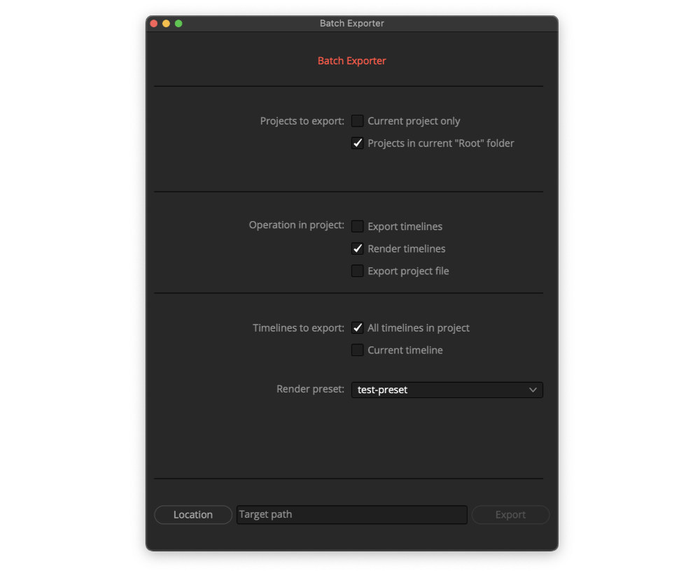

中文 | [English](README_EN.md)

# 简介
批量导出达芬奇项目、时间线

# 安装

- 请将 *Batch_export.py* 拷贝至达芬奇指定的脚本存放目录下
  - macOS: /Users/{你的用户名}/Library/Application Support/Blackmagic Design/DaVinci Resolve/Fusion/Scripts
  - Windows: C:\Users\{你的用户名}\AppData\Roaming\Blackmagic Design\DaVinci Resolve\Support\Fusion\Scripts
  - 根据需要再放进Scripts下的其中某一文件夹内，例如 *Edit*

- 在菜单：工作区(Workspace) > 脚本(Scripts) 中即可找到
- 仅支持在达芬奇内使用，不支持在外部运行

# 用法

通过本工具，可批量地：

- 将 *项目管理器* 中的同一文件夹内的各个项目，导出到指定位置（.drp）
  - 为了防止导出时间过长，因此不包含子文件夹内的项目
- 将 *项目内* 的各个时间线，导出到指定位置（.drt/.xml/.edl/.aaf/.csv/.txt）
  - 功能等同于菜单中 文件 > 导出 > 时间线
- 将 *项目内* 的各个时间线，以指定的渲染预设，添加渲染任务至渲染队列
- 同时可以实现 *多个项目x多个时间线* 

# 需要

- DaVinci Resolve 17 或更高版本
- Python 3.6 64-bit 
- 其他版本的 Python 在达芬奇18之前并不支持
- 无需额外的库

# [详细说明请见小黄灯公众号](https://mp.weixin.qq.com/s/lvEur-MiuF1o-9xkPxoVig)
日常出没于微信公众号「后期暗房小黄灯」Bilibili ID「张来吃」